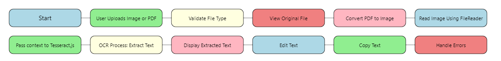

# OCR Scanner
## Flowchart

## Summary

The **OCR Scanner** application allows users to upload image files (PNG, JPG, JPEG) or PDFs, process them to extract text using Optical Character Recognition (OCR), and display the extracted text in a user-friendly, editable format. The application provides a visually appealing interface with the following key features:

- **File Upload**: Choose and upload image or PDF files.
- **Text Extraction**: Process the uploaded file to extract text.
- **Editable Text**: Display the extracted text in a content-editable area where users can make changes.
- **Copy Text**: Copy the extracted text to the clipboard for easy use.

The interface is designed to be stylish and mobile-responsive, ensuring a seamless experience across various devices. Animations enhance the visual appeal and interactivity of the application.

